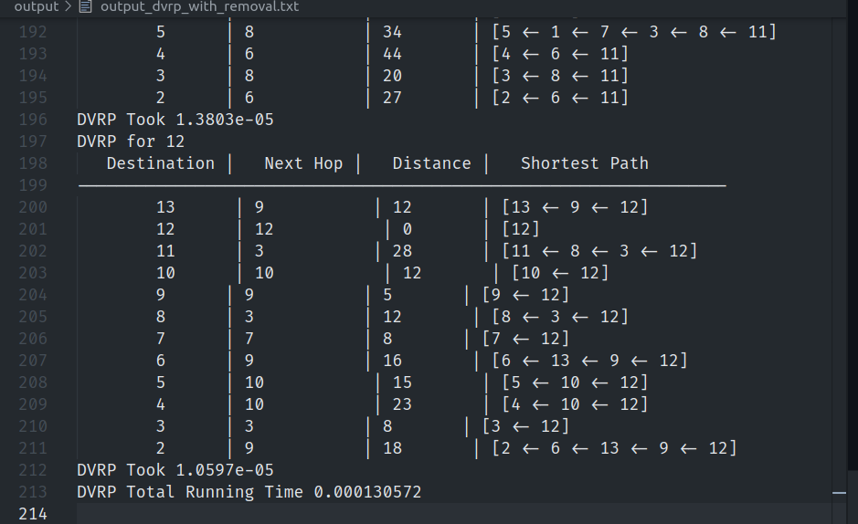
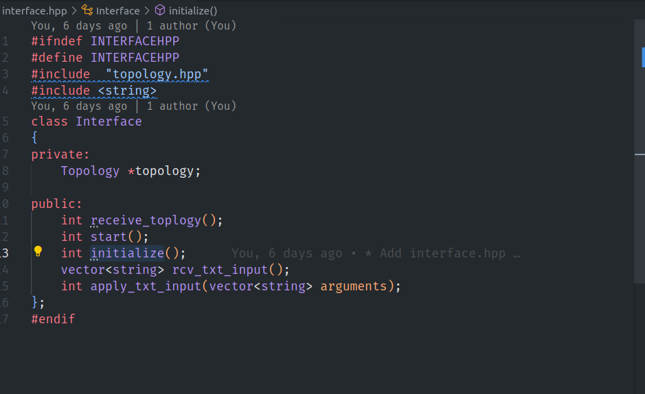

# CN-Algorithms

## How to run

You can run a simple test by executing test.sh

```
./test.sh
```

or
Build with

```
make
```

## Commands

### Record a topology for testing

```
topology <src,dest,cost>,<src_2,dest_2,cost_2>...
```

### Render an adjacency matrice for the toplogy

```
show 
```

### Remove a connection

```
remove <start,dst>
```

### Modify a connection

```
modify <start,dst,new_cost>
```

## Execution Results

```
./test.sh
```

#### Test.sh tests the LSRP and DVRP algorithms and reports their execution time

##### initial execution


##### Adjacency renderation


##### Running time for DVRP on all dests and sources


##### Running time for LSRP on all dests and sources


### Running the test that removes an edge 

```
sh test_edge_removal.sh
```

##### DVRP Results


##### DVRP With removal Results



##### LSRP Results


##### LSRP With removal Results


## Explaining the code 


### Interface
An interface is wrapped around the Algorithms, and the topology class which allows instantiation of their instances. 




### Topology 

a utillity class designed to act as a container for the data, the only class that offers certain degree of mutabillity 


### Algorithms and Their Implementations 
The algorithm look the same, both have implementations , reportage and profiling inside them .

##### The class supports the main functionalities mentioned


##### DVRP implementation follows a raw bellman ford approach


##### The class supports the main functionalities mentioned


##### Implementation closely follow the djkistra algorithm


## Explaining the results 

Linkstate algorithm whcih is based on  Djikstra algorithm  is actually O(V^3) but Bellman ford is of order O(E*V) and it's used by DVRP , now these orders are actually multiplied by v in our implementation , because they are for all nodes once, thus we expect the DVRP algorithm to have a better performance and our results adhere to that .