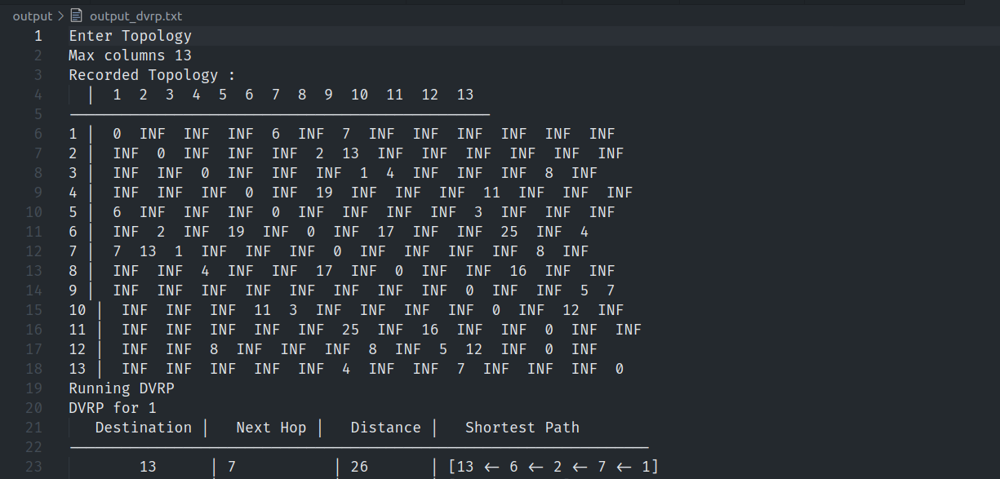

# CN-Algorithms

## How to run

You can run a simple test by executing test.sh

```
./test.sh
```

or
Build with

```
make
```

## Commands

### Record a topology for testing

```
topology <src,dest,cost>,<src_2,dest_2,cost_2>...
```

### Render an adjacency matrice for the toplogy

```
show 
```

### Remove a connection

```
remove <start,dst>
```

### Modify a connection

```
modify <start,dst,new_cost>
```

## Execution Results

```
./test.sh
```

#### Test.sh tests the LSRP and DVRP algorithms and reports their execution time

##### initial execution


##### Adjacency renderation



##### Running time for DVRP on all dests and sources


##### Running time for LSRP on all dests and sources


### Running the test that removes an edge 

```
sh test_edge_removal.sh
```

##### DVRP Results


##### LSRP Results


